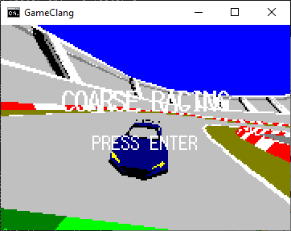
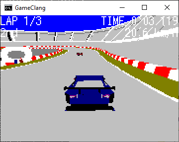
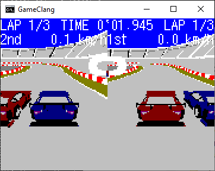

CNSGLib サンプル2 レースゲーム
=====
簡易レーシングゲーム。二人プレイ対応。
概要
-----
コマンドプロンプト上で動く3Dレーシングゲームです。  
自作ライブラリCNSGLibによって動作しています。  
GameClangがClangコンパイラ、GameBcc32がBcc32(bcc55)によってコンパイルされたものです。  

BGMは魔王魂様からお借りしております。

起動方法
-----
リポジトリをクローンしてGameClang（ショートカット）を実行してください。  
レガシーコンソールの方がうまく動くかもしれません。

操作
-----
### タイトル画面/メニュー

- `↑/↓` : 選択
- `ENTER` : 決定

### レース
- `ESC` : メニュー

#### 1Pプレイ

- `W` : アクセル
- `S` : ブレーキ・バック
- `A/D` : ハンドル
- `←/→` : 視点操作
- `↑/↓` : ズームイン/アウト

#### 2Pプレイ

1Pが青。2Pが赤です。
- `W` : 1Pアクセル
- `S` : 1Pブレーキ・バック
- `A/D` : 1Pハンドル
- `↑` : 2Pアクセル
- `↓` : 2Pブレーキ・バック
- `←/→` : 2Pハンドル

コンパイル
-----
本プログラムはGNU Makeでコンパイルできます。
- `make` : Clangでコンパイルします。
- `make bcc32` : Bcc32でコンパイルします。
- `make clean` : オブジェクトをクリーンします。
